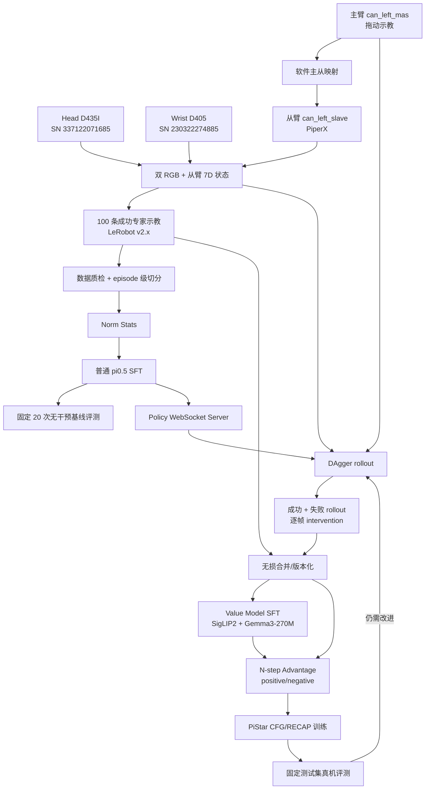

# PiperX 插头插拔任务 PiStar/RECAP 真机开发文档

> 日期：2026-08-17  
> 当前阶段：**文档评审，尚未修改业务代码，尚未执行真机、数采、训练或部署命令**  
> 目标：单臂 PiperX 抓起黑色插头并插入白色两孔插座，完成 `100 条专家示教 -> SFT -> DAgger -> Value Model -> Advantage 标签 -> RECAP/PiStar CFG -> 真机评测`。

## 1. 结论与执行边界

当前 codebase 已经具备单臂主从遥操作、LeRobot RL 字段、普通 pi0.5/PiStar 训练、Value Model、Advantage 标注和策略服务的主要组件，但**还不能零修改跑通本任务**。本轮采用“最少改动、先跑通”策略：允许直接写死本机路径和本任务硬件参数，不做通用 CLI 化，不新增额外机械臂安全框架，也不重写现有 DAgger 架构。只修复会直接阻塞双 CAN、相机、数据、Value 或 PiStar CFG 的问题。

本项目按以下边界执行：

1. 本文档确认前，只做静态代码审查和文档修改。
2. 本文档确认后，先完成第 5 节代码改造和静态/无硬件测试，再进入真机预检。
3. 所有标记为 `[真机-会运动]` 的命令都必须由现场人员逐条确认后运行，急停可用且工作空间内无人。
4. 不使用通电插座进行早期实验。默认使用断电、固定牢靠、具有机械限位或柔顺结构的插座治具。
5. 静态测试、相机预览和假数据测试都不能视为真机安全证明。

### 1.1 本轮明确结论

1. **D405 当前是否默认 720p**：`RealsenseSensor` 没有按 D405 型号设置独立默认值，但会对所有 RealSense 首先尝试 `1280x720@10`，随后尝试 `1280x720@30`、`1280x720@15`，最后才 fallback 到 `640x480@30`。`PiperSingleLeRobot` 和 RL collector 的 image schema 也写成 `(720,1280)`。因此当前代码是“720p 优先”，不是“强制保证 720p”；启动日志必须确认实际 profile 没有退到 640x480。
2. **当前 `move_check` 是否默认开启**：是，本任务保持 `True`。`CollectLeRobotRL` 和 `PiperSingleLeRobot` 的默认值都是 `True`，专家采集脚本显式设置 `MOVE_CHECK=True`，DAgger collector 也显式传入 `move_check=True`。仓库文档将其定义为“跳过静止帧，减少数据冗余”，单元测试也验证了首帧保留、重复静止帧跳过、移动帧保留的行为。因此专家采集和 DAgger 都不修改该值。
3. **路径策略**：允许写死当前实验机路径。VLM 权重、LeRobot 数据和 OpenPI JAX checkpoint 分别固定在仓库内 `.cache/huggingface/hub/models--ybpy--vlm_ckpt`、`.cache/huggingface/lerobot/piperx`、`.cache/openpi`。
4. **安全代码策略**：本轮不新增统一 action safety、slew limit、控制超时或相机新鲜度模块。继续使用现有输出关节/夹爪 clamp、低速初始化、现场急停和逐臂确认；额外安全代码放到 pipeline 跑通后再评估。

`move_check=True` 的仓库依据：

- `control_your_robot/src/robot/data/collect_lerobot_rl.py`：`CollectLeRobotRL` 构造参数默认为 `True`；开启后第一帧保留，后续与上一次控制器状态相比，所有维度均不超过 `tolerance` 时跳过该帧。
- `control_your_robot/my_robot/piper_single_lerobot.py`：`PiperSingleLeRobot` 的 `move_check` 默认为 `True` 并传给 collector。
- `control_your_robot/example/collect/collect_lerobot_master_slave_teleop.py`：专家采集显式设置 `MOVE_CHECK = True`。
- `control_your_robot/example/deploy/piper_dagger_on_PI0.py`：DAgger collector 显式设置 `move_check=True`。
- `control_your_robot/docs/LEROBOT_DIRECT_COLLECT.md` 和 `control_your_robot/docs/deployment_with_collection*.md`：将移动检测说明为跳过静止帧、减少数据冗余；`control_your_robot/tests/test_collect_lerobot_rl.py` 中有对应行为测试。

### 1.2 推荐主线

本次先走 **PiStar 仓库原生链路**：

```text
成功专家示教 -> 普通 pi0.5 SFT -> DAgger 成功/失败 rollout
             -> 本仓库 Value Model -> 内联 adv_ind 标签
             -> PiStar advantage-conditioned + CFG 训练 -> 真机评测
```

这条链路在算法目的上对应 RECAP 的 `value -> advantage -> CFG policy optimization`，且与当前采集字段最接近。

`temp/RLinf` 中也有正式命名的 RECAP 流程，但当前不能直接作为 PiperX 主线：其 value/advantage 数据变换只注册了 Libero/Franka 等 robot type，rollout 还要求 `is_success` 字段，CFG 默认使用 PyTorch OpenPI 和 `pi05_libero`。第 14 节给出两套实现的边界。若要求“必须由 RLinf launcher 启动 Step 1-4”，需要增加一条独立的 PiperX 适配和 JAX/PyTorch checkpoint 对齐工作。

## 2. 整体架构



## 3. 已确认硬件与任务常量

| 项目 | 本任务配置 | 说明 |
|---|---|---|
| 从臂 | PiperX，`can_left_slave` | 策略实际控制对象 |
| 主臂 | Piper/PiperX API，`can_left_mas` | 仅用于专家示教和 DAgger 人工接管 |
| 从臂初始关节 | `[0, 1.0, -1.0, 1.0, 0, 0]` rad | 与 `one_arm_go_init.sh` 实际 `JOINT_RAD` 一致 |
| 从臂初始夹爪 | `0` | 当前控制约定中 `0=闭合`、`1=打开` |
| 主臂初始关节 | `[0, 1.0, -1.0, 1.0, 0, 0]` rad | 已确认与从臂相同 |
| 主臂初始夹爪 | `0` | 已确认与从臂相同，`0=闭合` |
| 腕部相机 | RealSense D405，`230322274885` | 数据键 `wrist_image` |
| 头部相机 | RealSense D435I，`337122071685` | 数据键 `image` |
| 采集调度频率 | 初始方案 `10 Hz` | 沿用现有数据管线；`move_check=True` 后实际落盘帧可稀疏、非等间隔 |
| 动作维度 | `7` | 6 个绝对关节角 rad + 1 个归一化夹爪开度 |
| 语言指令 | `Pick up the black plug and insert it into the white two-hole socket.` | SFT、部署、Value 训练必须保持一致 |
| 专家数据量 | `100` 个**保存成功**的 episode | 失败演示按空格丢弃，不计入 100 |

主臂和从臂的目标初始值已确认相同，均为 `[0, 1.0, -1.0, 1.0, 0, 0, gripper=0]`。现有遥操作代码仍需在启动时读取两臂的实际反馈并建立 runtime offset，用于吸收复位误差和零点偏差，而不是补偿不同的目标初值。改造后要把实际 offset、首帧误差和映射后的首条命令写入日志；在对齐完成前禁止下发镜像动作。

## 4. 当前 codebase 审查结果

### 4.1 已有可复用能力

| 能力 | 位置 | 当前结论 |
|---|---|---|
| 单臂初始化/回零 | `control_your_robot/scripts/piperx/one_arm_go_init.sh`、`one_arm_go_zero.sh` | 已支持 CAN 名参数；init 实际关节为本任务给定值 |
| 软件主从示教 | `control_your_robot/example/collect/collect_lerobot_master_slave_teleop.py` | 已支持主臂拖动示教、运行时主从 offset 对齐 |
| 单臂 LeRobot 采集 | `PiperSingleLeRobot` + `CollectLeRobotRL` | 已有双图像、7D state/action、intervention/value/reward/adv 字段 |
| 普通 pi0.5/PiStar 数据变换 | `LeRobotLiberoDataConfig` | 当前 `image`、`wrist_image`、`state`、`actions` 字段可复用 |
| Norm/SFT | `scripts/compute_norm_stats.py`、`scripts/train.py` | 入口可复用，需新增本任务 train/infer config |
| WebSocket 策略服务 | `scripts/serve_policy.py` | 用于普通 SFT 和最终 PiStar 真机部署 |
| 数据合并 | `scripts/merge_datasets.py` | 会严格保留 14 个既定字段，不补缺失字段 |
| Value Model | `scripts/train_value.py` | 架构和训练入口已存在，但有路径/配置阻塞 |
| Advantage 标注 | `scripts/label_advantage_from_vlm.py` | 能生成内联 `adv_ind=positive/negative` |
| DAgger | `control_your_robot/example/deploy/piper_dagger_on_PI0.py` | 继续复用现有本地推理实现，只改本任务路径、config、CAN、复位和相机参数 |

### 4.2 必须修复的阻塞

| 优先级 | 阻塞 | 风险/后果 | 计划处理/当前状态 |
|---|---|---|---|
| P0 | 当前只有四臂 CAN 激活脚本 | 只管理主臂和插入从臂时可能认错接口 | **已完成**：新增 `control_your_robot/scripts/piperx/2_arm_can_activate.sh`，只管理两个已确认 bus-info，其他 CAN 保持不变 |
| P0 | `temp/robocoin` 是指向外部 RoboCOIN 的本机符号链接 | 新 clone 的 PiStar 不会包含这些脚本 | **已完成**：双 CAN、只读枚举、单臂 init/zero 及 `ctrl_joint.py` 已放入 `control_your_robot/scripts/piperx/` |
| P0 | 相机配置原先是旧 SN | 可能打开错误设备或直接失败 | **已完成**：`camera_config.py` 的 single/DAgger profile 已统一为本任务两个 SN |
| P0 | RealSense 允许 fallback 到 640x480 | 与固定 720x1280 schema 冲突 | 不改相机框架；在 5 条 pilot 启动日志中确认实际 profile 为 720p，否则再做单点修复 |
| P0 | 采集脚本原先写死旧路径、`can0/can1` 和旧任务配置 | 无法采本任务数据 | **已完成**：改为本机缓存路径、100 episode、黑色插头提示词、正确 CAN 和复位值 |
| P1 | `move_check=True` 会压缩长时静止段 | 落盘帧不再严格等间隔，长时抓稳/对齐保持不会按 10 Hz 完整保留 | 与当前专家采集、DAgger 和仓库文档保持一致，继续使用 `True`；质检按保留帧解读时间轴 |
| P0 | `DataConfig` 无 `local_data_dir` 字段，但 value 路径直接使用 | Value 训练/标注可能在构造或加载时失败 | 增加字段和本地数据加载测试 |
| P0 | Value loader 写死另一用户的 `/public/home/...` | 当前机器无法加载 SigLIP2/Gemma3 | 直接替换为本仓库 `.cache` 中已存在的 snapshot 路径 |
| P0 | PiStar transform 未设置 `adv_guidance_input=True` | 推理时没有 `tokenized_prompt_uncond`，CFG 分支不会启用 | 接入 infer transform，并测试 guidance beta 确实改变动作 |
| P1 | `one_arm_go_init.sh` 旧注释写 J5=0.24 | 注释和实际命令不一致 | **已完成**：新脚本注释和实际目标均为 J5=0，默认夹爪为 0 |
| P1 | DAgger 的 vendored OpenPI config 与根目录 config 是两份代码 | 本地 DAgger 可能找不到新 infer config | 只同步增加本任务 infer config，不重写 DAgger 为 WebSocket |
| P1 | Advantage 脚本原地改 parquet | 标注失败可能污染数据 | 标注前直接 `cp -a` 一份新目录，不新增 clone 工具 |

## 5. 文档确认后的代码改造范围

只在用户确认本文档后实施：

1. **已完成**：新建受 Git 跟踪的 `control_your_robot/scripts/piperx/`，放入 `2_arm_can_activate.sh`、`find_all_can_port.sh`、`one_arm_go_init.sh`、`one_arm_go_zero.sh` 和 `ctrl_joint.py`。双 CAN 脚本只修改 `can_left_mas`、`can_left_slave` 两个硬编码映射。
2. **已完成**：已新增 `control_your_robot/tools/piperx_camera_profile_test.py`，并在 `camera_config.py` 中把 single/DAgger profile 统一写死为 head `337122071685`、wrist `230322274885`；保留当前 720p 优先 profile 逻辑。
3. **已完成**：直接修改专家采集常量，包括 repo ID、缓存根目录、任务文本、100 episode、`can_left_mas/can_left_slave` 和相同 reset pose；`MOVE_CHECK=True` 保持现状。不新增 CLI，不改变“下一帧 state 作为 action”的现有语义。
4. **部分完成**：普通部署和 DAgger 的 CAN、相机、主从 reset pose 已修改；数据/model 路径后续随训练配置落地。DAgger collector 保持 `move_check=True`，继续使用现有 `piper_dagger_on_PI0.py`。
5. 新增本任务的 4 个根目录配置：
   - `pi05_piperx_plug_sft`
   - `pi05_piperx_plug_sft_infer`
   - `pi05_star_piperx_plug_recap`
   - `pi05_star_piperx_plug_recap_infer`
6. 在 vendored OpenPI config 中只同步增加 DAgger 所需的 `pi05_piperx_plug_sft_infer`，避免重构现有本地推理。
7. 给 `DataConfig` 增加 `local_data_dir`；把 Value loader 和 tokenizer 默认值直接改成本仓库 VLM snapshot；不新增权重 CLI。
8. 接通 PiStar CFG 的 unconditional prompt，并增加一个最小 transform/model 测试，确认 guidance 分支实际执行。

本轮明确不做：通用硬件配置类、新动作安全层、WebSocket DAgger、新 dataset validator/split/clone 工具、RLinf PiperX 适配、采集 action 语义重构。

## 6. 命令约定与目录规划

下面路径基于当前实验机 checkout。`my_env.sh` 使用 `$(pwd)` 设置缓存路径，所以每次必须先回到 PiStar 根目录再 source，不能在 `control_your_robot/` 中重新 source。

```bash
export PISTAR_ROOT=/home/standard/workspace/test/pistar
export CONTROL_ROOT="$PISTAR_ROOT/control_your_robot"
export PIPER_SCRIPTS="$CONTROL_ROOT/scripts/piperx"

export HF_LEROBOT_HOME="$PISTAR_ROOT/.cache/huggingface/lerobot"
export PISTAR_DATA_ROOT="$HF_LEROBOT_HOME/piperx"
export OPENPI_DATA_HOME="$PISTAR_ROOT/.cache/openpi"
export PI05_BASE_PARAMS="$OPENPI_DATA_HOME/openpi-assets/checkpoints/pi05_base/params"

export VLM_SNAPSHOT="$PISTAR_ROOT/.cache/huggingface/hub/models--ybpy--vlm_ckpt/snapshots/c266f612b9c3a1d3cd75d6c194564d4db754e070"
export SIGLIP2_PARAMS="$VLM_SNAPSHOT/siglip2-so400m-patch14-224-jax/siglip2_so400m14_224.npz"
export GEMMA3_CKPT="$VLM_SNAPSHOT/gemma-3-270m"
export GEMMA3_TOKENIZER="$VLM_SNAPSHOT/tokenizer.model"

export DEMO_REPO_ID="piperx/piperx_black_plug_demo_v1"
export DAGGER_REPO_ID="piperx/piperx_plug_dagger_v1"
export DEMO_DATASET="$HF_LEROBOT_HOME/$DEMO_REPO_ID"
export DAGGER_DATASET="$HF_LEROBOT_HOME/$DAGGER_REPO_ID"
export MIXED_UNLABELED="$PISTAR_DATA_ROOT/piperx_plug_mixed_unlabeled_v1"
export MIXED_LABELED="$PISTAR_DATA_ROOT/piperx_plug_mixed_adv_v1"
export VALUE_CKPT="$OPENPI_DATA_HOME/value_checkpoints/value_piperx_plug_v1"
export SFT_CKPT_ROOT="$OPENPI_DATA_HOME/checkpoints/pi05_piperx_plug_sft/plug_sft_v1"
export RECAP_CKPT_ROOT="$OPENPI_DATA_HOME/checkpoints/pi05_star_piperx_plug_recap/plug_recap_v1"
```

当前 snapshot 和 base checkpoint 已在本机发现。每次运行前仍检查关键路径，防止新 clone 尚未准备缓存：

```bash
test -d "$PISTAR_DATA_ROOT"
test -d "$PI05_BASE_PARAMS"
test -f "$SIGLIP2_PARAMS"
test -d "$GEMMA3_CKPT"
test -f "$GEMMA3_TOKENIZER"
```

### 6.1 从新机器安装环境

只在新机器/新 checkout 执行。`cd` 必须发生在 `source my_env.sh` 之前，因为该脚本按当前工作目录生成 `UV_CACHE_DIR`、`HF_LEROBOT_HOME` 和 `OPENPI_DATA_HOME`。

```bash
git clone https://github.com/ybpy/pistar.git /path/to/pistar
cd /path/to/pistar
export PISTAR_ROOT="$PWD"

git submodule update --init --recursive

# 第一次 source 设置仓库内缓存路径；此时 .venv 可以尚不存在。
source my_env.sh
uv venv --python 3.11.9

# 第二次 source 激活刚创建的 .venv。
source my_env.sh

GIT_LFS_SKIP_SMUDGE=1 uv sync --active
GIT_LFS_SKIP_SMUDGE=1 uv pip install -e .
uv pip install -r pistar_requirements.txt
```

`pistar_requirements.txt` 已补入本真机链路缺失的 `piper-sdk==0.6.1` 和 `pyrealsense2==2.56.5.9235`，因此新环境仍执行上述原命令，不需要再单独安装这两项。

新机器若尚未同步权重，再执行：

```bash
hf download ybpy/vlm_ckpt \
  --cache-dir "$PISTAR_ROOT/.cache/huggingface/hub"

python -c "from openpi.shared import download; print(download.maybe_download('gs://openpi-assets/checkpoints/pi05_base/params'))"
```

当前实验机已经存在 VLM snapshot `c266f612b9c3a1d3cd75d6c194564d4db754e070` 和 `.cache/openpi/openpi-assets/checkpoints/pi05_base/params`，本轮不会重复下载。

安装验收：

```bash
cd /path/to/pistar
source my_env.sh

python --version
git submodule status --recursive
python -c "import jax, flax, lerobot, pyrealsense2; print(jax.devices())"
printf '%s\n' "$UV_CACHE_DIR" "$HF_LEROBOT_HOME" "$OPENPI_DATA_HOME"
```

预期 Python 为 `3.11.9`，三个缓存变量都位于 `/path/to/pistar/.cache/`。`temp/robocoin` 是当前机器的外部符号链接，不会随 GitHub clone 或 submodule 命令出现；第 5 节要求的 PiperX 脚本必须提交到 `control_your_robot/scripts/piperx/` 后，新 clone 才能独立运行。

## 7. Step 0：环境、相机和 CAN 只读预检

### 7.1 软件环境

`[只读/不控制机械臂]`

```bash
cd "$PISTAR_ROOT"
source my_env.sh
git rev-parse HEAD
git status --short
python --version
uv --version
nvidia-smi
```

验收：记录 Git SHA、Python/uv/JAX/CUDA 版本、GPU 型号/数量/显存。训练 batch size 和 `fsdp_devices` 必须在这些信息确认后确定，不能直接照搬旧 white-plug 配置的 2 卡/64 batch。

### 7.2 RealSense 枚举与 profile

`[只读/不控制机械臂]`

```bash
rs-enumerate-devices -s
rs-enumerate-devices -c
python control_your_robot/tools/piperx_camera_profile_test.py --list-only
python control_your_robot/tools/piperx_camera_profile_test.py --frames 10
```

必须看到且只绑定：

```text
wrist: Intel RealSense D405  230322274885
head:  Intel RealSense D435I 337122071685
```

新增的 profile 脚本会先核对序列号与机型，列出候选 BGR8 profile，再严格按生产代码的顺序依次尝试 `1280x720@10/30/15` 和 `640x480@30`。它按生产顺序先启动 head、保持 head 运行再启动 wrist，最后在两路同时运行时各抓取 10 帧。只有两路均为 `1280x720`才输出 `CAMERA_PROFILE_CHECK=PASS`。

2026-08-17 的 `rs-enumerate-devices -c` 已确认 D405 `230322274885` 支持 `1280x720` BGR8 的 30/15/5 FPS，**不支持 10 FPS**，所以当前生产代码对 D405 会先尝试并拒绝 10 FPS，然后正常选中 `1280x720@30`。完整双流测试仍以脚本实际 `PASS` 为准。

把 `camera_config.py` 的两个 SN 改为本任务值后，在 5 条专家 pilot 启动日志中必须看到两次类似输出：

```text
Started camera: cam_head  (SN: 337122071685, profile=1280x720@...)
Started camera: cam_wrist (SN: 230322274885, profile=1280x720@...)
```

实际分辨率必须是 `1280x720`；数据调度器仍以 10 Hz 采样，不要将该频率与相机 stream FPS 混淆。若日志显示 `640x480@30`，立即停止 pilot，因为当前 LeRobot schema 固定为 `(720,1280)`。

### 7.3 CAN 身份确认

`[只读；ethtool 可能需要 sudo，但不会控制机械臂]`

```bash
ip -br link show type can
bash "$PIPER_SCRIPTS/find_all_can_port.sh"
bash "$PIPER_SCRIPTS/2_arm_can_activate.sh" --check
```

把实际结果填入：

```text
MASTER_USB_BUS_INFO = 1-4.1.1:1.0 -> can_left_mas
SLAVE_USB_BUS_INFO  = 1-4.1.3:1.0 -> can_left_slave
BITRATE             = 1000000
```

2026-08-17 首次只读枚举时系统实际存在 4 路 CAN；上述两路均为 `UP`/`ERROR-ACTIVE` 且 bitrate 为 1 Mbps。**不要运行现有 `4_arm_can_activate.sh`**；本任务只使用一主一从，新脚本会显式跳过另外两路。bus-info 到当前逻辑名称的映射已确认，但物理机械臂角色仍必须通过 8.3 节逐臂运动验收。

## 8. Step 1：双 CAN 激活、机械臂激活和安全复位

### 8.1 激活两个 CAN

`[已新增][真机准备，不应产生关节运动]`

现场先将两根 USB-CAN 线分别贴上“主臂”和“插入从臂”标签。最稳妥的 bus-info 确认方式是在机械臂不执行控制程序时，每次只连接一个 USB-CAN，运行 `find_all_can_port.sh` 并记录结果；两根线都接回后再写入脚本：

```bash
# control_your_robot/scripts/piperx/2_arm_can_activate.sh 内的固定映射
MASTER_BUS_INFO="1-4.1.1:1.0"  # -> can_left_mas
SLAVE_BUS_INFO="1-4.1.3:1.0"   # -> can_left_slave
BITRATE=1000000
```

随后执行：

```bash
bash "$PIPER_SCRIPTS/2_arm_can_activate.sh" --check
bash "$PIPER_SCRIPTS/2_arm_can_activate.sh"
ip -details link show can_left_mas
ip -details link show can_left_slave
```

脚本只管理上述两个 bus-info，目标名固定为 `can_left_mas` 和 `can_left_slave`，bitrate 固定为 `1000000`。允许系统存在其他 CAN，但会显示 `Leaving unrelated CAN interface untouched` 且不修改它们。任一目标 bus-info 缺失、重复、目标名被其他 bus-info 占用，都必须在修改接口前退出。`--check` 为完全只读模式。

### 8.2 主、从臂复位到相同的任务初始位姿

现场前置条件：急停可触达；机械臂附近无人；插头/插座未放入碰撞路径；速度 10；先目视确认当前姿态到目标姿态的路径可达。

两条命令都属于 `[真机-会运动]`，必须逐臂执行和确认，不得同时后台运行：

```bash
# 先复位从臂并核对反馈
bash "$PIPER_SCRIPTS/one_arm_go_init.sh" can_left_slave 10 0

# 再复位主臂并核对反馈
bash "$PIPER_SCRIPTS/one_arm_go_init.sh" can_left_mas 10 0
```

两臂的预期目标均为：

```text
joint = [0, 1.0, -1.0, 1.0, 0, 0] rad
gripper = 0 (closed)
```

`one_arm_go_zero.sh` 只用于维护/排障，不是本任务 episode reset：

```bash
# [真机-会运动] 仅在明确需要机械零位时使用
bash "$PIPER_SCRIPTS/one_arm_go_zero.sh" can_left_slave 10 0
```

初始化脚本会暂时把目标臂配置为可软件控制的 follower role。主臂到位并核对反馈后，由采集/DAgger 程序将 `can_left_mas` 切换到 `MASTER(0xFA)` 拖动模式，再根据两臂实际反馈建立 runtime offset。即使目标值相同，也不能跳过反馈对齐或直接假设 offset 为零。

### 8.3 插入机械臂与 CAN 接口验收

第 8.2 节两条命令同时承担接口验收，必须现场逐项记录：

1. 执行 `can_left_slave` init 时，**只有实际执行插入任务的 PiperX 从臂移动**；主臂不能移动。
2. 执行 `can_left_mas` init 时，**只有人工拖动示教主臂移动**；插入从臂不能移动。
3. 两臂反馈都到达 `[0, 1.0, -1.0, 1.0, 0, 0]`，夹爪均闭合。
4. 专家采集程序启动后，拖动主臂一个小幅、易辨认的方向，从臂应做同方向响应；若反向、无响应或另一条臂运动，立即停止并修正 bus-info 映射。
5. 只有前四项全部通过，实验记录中才能写入 `CAN_ROLE_CHECK=PASS`，之后的数采、部署和 DAgger 才允许继续。

这一步不新增额外安全代码，使用现有 init 和软件主从路径确认“插入机械臂、主臂、CAN 名、物理线缆”四者一一对应。

### 8.4 2026-08-17 实施与验证记录

- 已新增 5 个受版本控制的 CAN 文件：`2_arm_can_activate.sh`、`find_all_can_port.sh`、`one_arm_go_init.sh`、`one_arm_go_zero.sh`、`ctrl_joint.py`。
- Shell 语法检查、两个单臂脚本 `--help`、Python 编译检查均通过；未执行不带 `--check` 的 CAN 激活，未连接 `piper_sdk` 控制机械臂，也未执行 init/zero。
- 实施初期只读确认 `1-4.1.1:1.0 -> can_left_mas` 和 `1-4.1.3:1.0 -> can_left_slave`，两路均为 1 Mbps。随后所有 USB-CAN 和 RealSense 从系统 USB 枚举中消失，此时新 CAN 脚本正确非零退出并报告 `no CAN interfaces found`。
- 物理“插入从臂/主臂”身份尚未运动验收，因此当前不得记录 `CAN_ROLE_CHECK=PASS`。重新接入设备后，必须重跑 7.2、7.3 和 8.2/8.3。

## 9. Step 2：采集 100 条专家示教

### 9.1 数据采集命令

为减少改动，不增加 argparse。`collect_lerobot_master_slave_teleop.py` 底部常量已修改为：

```python
REPO_ID = "piperx/piperx_black_plug_demo_v1"
OUTPUT_DIR = "/home/standard/workspace/test/pistar/.cache/huggingface/lerobot"
TASK_NAME = "Pick up the black plug and insert it into the white two-hole socket."
FPS = 10
NUM_EPISODES = 100
MASTER_CAN = "can_left_mas"
SLAVE_CAN = "can_left_slave"
MOVE_CHECK = True
RESET_JOINT_POSITION = [0, 1.0, -1.0, 1.0, 0, 0]
```

相机 SN 由同一次改动中的 `camera_config.py` 提供。主臂已在第 8.2 节复位，采集程序保留现有 runtime offset 对齐。

`[修改常量后][真机-会持续运动]`

```bash
cd "$PISTAR_ROOT"
source my_env.sh
cd "$CONTROL_ROOT"
export PYTHONPATH="$PWD:$PWD/src:${PYTHONPATH:-}"
python example/collect/collect_lerobot_master_slave_teleop.py
```

交互约定沿用现有脚本：

- `Enter`：开始 episode；再次按 `Enter`：成功后结束并保存。
- `Space`：立即放弃当前 episode，不计入 100。
- `Ctrl+C`：停止采集并等待现有 worker 清理完成。

### 9.2 单条示教流程

1. 主、从臂分别复位到 `[0, 1.0, -1.0, 1.0, 0, 0, gripper=0]`，核对两臂实际反馈后建立 runtime offset。
2. 放置插头和插座，记录场景 variation ID；插座固定且断电。
3. 确认主从 offset 对齐完成，首条映射命令没有跳变。
4. 按 Enter 开始，以主臂控制从臂打开夹爪、接近并抓稳插头。
5. 采用分阶段动作：上方接近、下降、抓取、抬起、插座前预对齐、轴向插入。
6. 插入后保持至少 2 秒，现场确认成功标准，再按 Enter 保存。
7. 若掉落、错孔、明显碰撞、相机遮挡、时间戳异常或中途重置，按 Space 丢弃。

### 9.3 成功定义

正式成功标准在开采前由用户确认，初始建议为：插头方向正确、进入指定插孔并达到机械限位/深度阈值，松开或保持夹爪后持续 2 秒不脱出，没有人工触碰从臂/插头完成最后对准。需补充可测量的插入深度/姿态容差；仅凭“看起来接近”不能作为标签。

### 9.4 采集分布

100 条是保存成功数，不是尝试数。建议按 4 组各 25 条组织，每组后做一次质检：

| 维度 | 要求 |
|---|---|
| 插头初始位置/朝向 | 在策略预期工作区内有覆盖，不能每条完全相同 |
| 插座位置 | 治具允许范围内小幅变化，并记录 variation ID |
| 光照/背景 | 覆盖合理变化，但相机外参和安装必须固定 |
| 动作速度 | 覆盖自然专家速度，不人为删除必要停顿 |
| 失败处理 | 专家数据失败即丢弃；失败轨迹留给 DAgger 数据集 |

## 10. Step 3：数据处理、质检和 SFT

### 10.1 原始数据不可变

采集完成后将 `piperx_black_plug_demo_v1` 标记为 raw，只允许派生新目录，不在原目录过滤、标注或覆盖 parquet。生成 manifest：Git SHA、命令、相机 SN/profile、CAN 映射、任务文本、episode 数/帧数、数据哈希。

### 10.2 数据校验

不新增 validator 文件，直接用现有依赖检查 meta 和每个 episode parquet：

```bash
cd "$PISTAR_ROOT"
python - "$DEMO_DATASET" <<'PY'
import json
import sys
from pathlib import Path

import pyarrow.parquet as pq

root = Path(sys.argv[1])
info = json.loads((root / "meta/info.json").read_text())
files = sorted((root / "data").glob("chunk-*/episode_*.parquet"))
required = {
    "image", "wrist_image", "state", "actions", "intervention",
    "value_label", "reward", "reward_label", "adv_ind",
    "timestamp", "frame_index", "episode_index", "index", "task_index",
}
assert info["total_episodes"] == 100, info["total_episodes"]
assert len(files) == 100, len(files)
for path in files:
    names = set(pq.read_schema(path).names)
    assert required <= names, (path, sorted(required - names))
print(f"PASS: episodes={len(files)}, fps={info['fps']}")
PY
```

自动门槛：

- 恰好 100 个可读 episode，index/frame/timestamp 单调且无断裂。
- `image`、`wrist_image` 与实际视频匹配，解码无空帧，采样 shape 一致。
- `state/actions` 均为 7D finite；夹爪在 `[0,1]`；关节在确认后的 PiperX 软限位内。
- `intervention=1`、`adv_ind=positive`；`value_label/reward/reward_label` 在预期范围。
- 每条长度至少为 `action_horizon + 1`；采集循环按 10 Hz 调度，但 `move_check=True` 会跳过未超过容差的帧，因此落盘相邻帧时间间隔允许大于 0.1 秒，不要用严格等间隔作为验收条件。
- 随机抽查 state/action 没有明显错位或异常尖峰。

人工回放：前 10 条、每 10 条抽 1 条、最后 10 条必须看完整双视角；任何自动异常 episode 必须全量回看。在首轮跑通中不再叠加执行旧任务的 `11_filter_nonidle_frames.py`：在线 `move_check=True` 已经按相邻控制器状态变化过滤静止帧，再次过滤会改变数据分布。人工回放时需确认抓稳、预对齐和插入终态的关键帧仍在保留数据中。

### 10.3 计算 SFT norm stats

`[新增 config 后][训练机]`

```bash
cd "$PISTAR_ROOT"
XLA_PYTHON_CLIENT_PREALLOCATE=false \
python scripts/compute_norm_stats.py --config-name pi05_piperx_plug_sft
```

`pi05_piperx_plug_sft` 直接使用 `repo_id="piperx/piperx_black_plug_demo_v1"`，并把 `assets_base_dir`、`checkpoint_base_dir` 写到 `.cache/openpi/assets` 和 `.cache/openpi/checkpoints`。检查 train/infer asset ID 一致；状态和动作统计必须是 7D、无 NaN/Inf。q01/q99 是线性归一化锚点，不是硬安全裁剪。

### 10.4 普通 pi0.5 SFT

`[新增 config 后][训练机]`

```bash
cd "$PISTAR_ROOT"
XLA_PYTHON_CLIENT_PREALLOCATE=true \
XLA_PYTHON_CLIENT_MEM_FRACTION=0.90 \
python scripts/train.py pi05_piperx_plug_sft \
  --exp-name=plug_sft_v1 \
  --overwrite
```

断点续训：

```bash
XLA_PYTHON_CLIENT_PREALLOCATE=true \
XLA_PYTHON_CLIENT_MEM_FRACTION=0.90 \
python scripts/train.py pi05_piperx_plug_sft \
  --exp-name=plug_sft_v1 \
  --resume
```

`pi05_piperx_plug_sft` 必须设置 `pistar=False`，以便把初始 SFT 和后续 RECAP 明确分开。训练步数、batch size、GPU/FSDP 数在硬件信息和首个小规模 overfit test 后填写，不直接继承旧配置。

## 11. Step 4：SFT 部署与固定基线评测

### 11.1 服务端

`[训练机/GPU，不控制机械臂]`

```bash
cd "$PISTAR_ROOT"
python scripts/serve_policy.py policy:checkpoint \
  --policy.config=pi05_piperx_plug_sft_infer \
  --policy.dir="$SFT_CKPT_ROOT/STEP" \
  --port=8000
```

`STEP` 替换为通过离线检查选择的具体 step。infer config 的 model、asset ID、norm stats 和训练 config 必须对应；普通 SFT 不要求 `adv_ind`。

### 11.2 真机客户端

在 `agilex_piper_single_base.py` 中把 reset pose 设为 `[0, 1.0, -1.0, 1.0, 0, 0]`；CAN 后续按本流程改为 `can_left_slave`，相机继续读取 `camera_config.py`。

`[修改常量后][真机-策略会持续控制从臂]`

```bash
cd "$PISTAR_ROOT"
source my_env.sh
cd "$CONTROL_ROOT"
python example/deploy/piper_single_on_PI0_websocket.py \
  --server-host TRAIN_SERVER_IP --server-port 8000 \
  --task-name "Pick up the black plug and insert it into the white two-hole socket." \
  --chunk-size 10 --control-freq 10 \
  --max-step 400 --num-episode 1
```

先做 1 条空载/远离插座的低速 smoke test，再做 5 条 pilot，最后固定 20 次无人工干预基线评测。记录成功率、掉落率、碰撞/安全拒绝次数、episode 时长、插入阶段失败类型。失败时按急停/客户端停止键，不能依赖模型自行恢复。

## 12. Step 5：DAgger 人工干预 rollout

### 12.1 数据目标

DAgger 数据必须包含成功和失败，而不是只保留成功。每帧保存：

- `intervention=0`：策略动作实际执行。
- `intervention=1`：主臂接管后实际下发并执行的动作。
- episode 结束时由操作者确认 success/failure，现有 collector 据此写入 `value_label/reward/reward_label`。
- 使用现有 state/action、时间戳和逐帧 intervention schema。

现有收集器把 action 定义为下一帧从臂 state。本轮为尽快打通 native PiStar pipeline，保留这一既有语义，不额外改造 command/feedback 双轨记录；该限制写入实验结论。

### 12.2 启动 DAgger

本轮继续使用现有本地推理 DAgger。确认文档后只做这些定点修改：

- `piper_dagger.py`：两臂 reset 已改为 `[0, 1.0, -1.0, 1.0, 0, 0]`；master/follower CAN 后续改为 `can_left_mas/can_left_slave`。
- `piper_dagger_on_PI0.py`：两个 fixed reset 已同步改为 `[0, 1.0, -1.0, 1.0, 0, 0]`，collector 的 `move_check=True` 保持现状。
- vendored OpenPI config：增加与根目录结构一致的 `pi05_piperx_plug_sft_infer`，用于加载 SFT JAX checkpoint。

`[上述修改后][真机-策略和主臂接管都会控制从臂]`

```bash
cd "$PISTAR_ROOT"
source my_env.sh
cd "$CONTROL_ROOT"
python example/deploy/piper_dagger_on_PI0.py \
  --model-path "$SFT_CKPT_ROOT/STEP" \
  --train-config pi05_piperx_plug_sft_infer \
  --repo-id "$DAGGER_REPO_ID" \
  --output-dir "$HF_LEROBOT_HOME" \
  --task-name "Pick up the black plug and insert it into the white two-hole socket." \
  --num-episode 5 \
  --fps 10
```

先采 5 条 pilot 并回放。通过后将 `--num-episode` 改为确认值；初始建议总量 30-50 条，但具体数量需要根据 20 次 SFT 基线中的失败模式和人工接管比例决定。

交互建议沿用当前 DAgger 语义：Space 切换 autonomous/intervention，Enter 结束 episode，随后明确输入 success/failure。接管时先暂停剩余 policy chunk，以从臂当前反馈作为主从映射基线，禁止旧 chunk 与人工命令交错执行。

### 12.3 DAgger 验收

```bash
cd "$PISTAR_ROOT"
python - "$DAGGER_DATASET" <<'PY'
import sys
from pathlib import Path

import pyarrow.parquet as pq

root = Path(sys.argv[1])
files = sorted((root / "data").glob("chunk-*/episode_*.parquet"))
modes = set()
for path in files:
    values = pq.read_table(path, columns=["intervention"])["intervention"].to_pylist()
    for value in values:
        modes.add(int(value[0] if isinstance(value, list) else value))
print(f"episodes={len(files)}, intervention_modes={sorted(modes)}")
assert modes == {0, 1}, modes
PY
```

人工记录至少包含 episode 成功率、每条干预帧比例、进入干预的任务阶段、失败类型和相机异常。若全部帧都是人工或全部帧都是自主，不能把它当作有效的混合 DAgger 轮次而不加说明。

## 13. Step 6：合并、Value Model、Advantage 和 PiStar RECAP

### 13.1 合并原始派生数据

`scripts/merge_datasets.py` 是纯合并器，源数据必须已经同时具备 14 个字段。输出目录是新版本：

```bash
cd "$PISTAR_ROOT"
python scripts/merge_datasets.py \
  --sources "$DEMO_DATASET" "$DAGGER_DATASET" \
  --output "$MIXED_UNLABELED" \
  --num-workers 8
```

仅在确认输出可删除并重建时才加 `--overwrite`。首次跑通不新增 split 工具，合并后至少运行下一节 batch 检查并记录 demo/rollout episode 数。

### 13.2 Value Model 架构与冻结策略

当前本仓库 Value Model 为：

```text
两路 224x224 RGB
  -> SigLIP 2 So400m/14 image backbone (1152-d tokens)
  -> trainable 1152->640 projection

Gemma3 tokenizer
  -> Gemma3-270M pretrained text embedding (640-d, forward 中 stop_gradient)

text query cross-attends image tokens
  -> [image tokens ; fused text tokens]
  -> pretrained Gemma3-270M 18-layer transformer backbone
  -> masked mean pool
  -> trainable MLP value head
  -> 201-bin categorical value distribution over [-1, 0]
```

本次基线使用 `--load_pretrained --freeze_mode all_backbones`：加载 SigLIP2 So400m/14 和 Gemma3-270M 的预训练权重，冻结 `img` 与 `llm` 两个 backbone，只训练 image projection、cross-attention、normalization 和 value head。这里使用的是 **Gemma3-270M 纯文本 backbone**；视觉来自独立 SigLIP2，再经过显式融合，并不是直接加载 Gemma3-4B 多模态模型。

### 13.3 Value 数据检查

修复 `local_data_dir` 后运行：

```bash
cd "$PISTAR_ROOT"
python scripts/check_value_data.py \
  --data_dir "$MIXED_UNLABELED" \
  --batch_size 8 --steps 3 --num_workers 0
```

验收：value target 在 `[-1,0]`，无 NaN/Inf；双图像被正确 resize；prompt mask 非空。为了先跑通，本轮直接使用合并数据训练；没有独立 validation split 是本轮结果的已知限制。

### 13.4 训练 Value Model

确认文档后，直接把 `ValueModelWeightLoader` 中两个旧绝对路径替换为 `$SIGLIP2_PARAMS` 和 `$GEMMA3_CKPT` 对应的当前绝对路径；`value_data_loader.py` 的旧 tokenizer 路径也替换为 `$GEMMA3_TOKENIZER`。不新增 `--siglip_path` 或 `--gemma_checkpoint_dir`。

`[硬编码路径修改后][训练机]`

```bash
cd "$PISTAR_ROOT"
XLA_PYTHON_CLIENT_PREALLOCATE=true \
XLA_PYTHON_CLIENT_MEM_FRACTION=0.90 \
python scripts/train_value.py \
  --data_dir "$MIXED_UNLABELED" \
  --checkpoint_dir "$VALUE_CKPT" \
  --tokenizer_path "$GEMMA3_TOKENIZER" \
  --load_pretrained \
  --freeze_mode all_backbones \
  --batch_size 32 \
  --num_train_steps 30000 \
  --save_interval 1000 \
  --num_workers 0 \
  --wandb_run_name value_piperx_plug_v1
```

最终 batch/FSDP 数量根据 GPU 决定。首次跑通可按训练 loss、预测范围和离线抽查选择 checkpoint；后续正式对比再补 episode 级 validation split。

### 13.5 生成 Advantage 标签

当前脚本会原地改写 parquet。为减少代码改动，直接复制一个新目录后再标注：

```bash
test ! -e "$MIXED_LABELED"
cp -a "$MIXED_UNLABELED" "$MIXED_LABELED"
```

再运行现有标注入口：

```bash
python scripts/label_advantage_from_vlm.py \
  --data_dir "$MIXED_LABELED" \
  --checkpoint_dir "$VALUE_CKPT" \
  --checkpoint_name step_XXXXXXXX \
  --tokenizer_path "$GEMMA3_TOKENIZER" \
  --batch_size 8 \
  --num_workers 0 \
  --lookahead 10 \
  --top_percent 30 \
  --reward_col reward_label \
  --human_col intervention \
  --adv_col adv_ind \
  --base_image_col image \
  --wrist_image_col wrist_image
```

`lookahead=10` 表示向后查看 10 个已保留帧，是和 RLinf 示例一致的初始值，不是最终最优值。由于 `move_check=True` 会跳过静止帧，10 个保留帧的实际时间跨度可能超过 1 秒，不能再直接按 10 Hz 换算。需要同时对 N=10/20 做离线分布、实际时间跨度统计和 episode 回放比较。当前规则为：全部人工示教保持 positive；rollout 中干预帧为 positive；自主帧按连续 advantage 的 top 30% 标 positive，其余 negative。

标注后必须报告 positive/negative 总比例、按 demo/rollout/episode/任务阶段的比例、value 和 advantage 分布，并回放至少 10 条带标签 episode。原始 `$MIXED_UNLABELED` 不得变化。

### 13.6 启动 PiStar RECAP/CFG 训练

先计算已标注数据的 norm stats：

```bash
cd "$PISTAR_ROOT"
XLA_PYTHON_CLIENT_PREALLOCATE=false \
python scripts/compute_norm_stats.py --config-name pi05_star_piperx_plug_recap
```

再从 SFT checkpoint 初始化 PiStar 训练。`pi05_star_piperx_plug_recap` 的 weight loader、assets 和 checkpoint base dir 都直接指向本任务 `.cache/openpi` 路径：

```bash
XLA_PYTHON_CLIENT_PREALLOCATE=true \
XLA_PYTHON_CLIENT_MEM_FRACTION=0.90 \
python scripts/train.py pi05_star_piperx_plug_recap \
  --exp-name=plug_recap_v1 \
  --overwrite
```

配置要求：

- `pistar=True`，`adv_ind_dropout=True`；dataset 使用 `$MIXED_LABELED`。
- weight loader 指向第 10.4 节选定的 SFT checkpoint。
- train/infer 共用正确 asset ID 和 7D norm stats。
- `pi05_star_piperx_plug_recap_infer` 使用 `adv_ind_dropout=False`，同时生成 conditional 和 unconditional prompt。
- 推理客户端显式传 `adv_ind=positive`；本轮不额外改造服务端 metadata。
- 在启动正式训练前，单元测试必须证明 `adv_guidance_beta=0/1/2` 会走 CFG 分支并产生可解释的动作差异；否则不能把该训练称为已跑通 RECAP CFG。

## 14. RLinf RECAP 与本仓库原生链路的关系

| 项目 | 当前 PiStar 仓库 | `temp/RLinf` RECAP |
|---|---|---|
| Return/Value 标签 | 采集器直接写内联 `value_label/reward_label` | Step 1 写 `meta/returns_<tag>.parquet` sidecar |
| Value Model | JAX/Flax，SigLIP2 + Gemma3-270M + cross-attention + C51 head | PyTorch 路线，SigLIP2 + Gemma3 + Critic Expert |
| Advantage 输出 | parquet 内联字符串 `adv_ind` | `meta/advantages_<tag>.parquet`，布尔和连续值 |
| rollout success | 当前 schema 未保留 `is_success` | 非 SFT rollout 强制需要 `is_success` |
| robot transform | 当前 `image/wrist_image/state/actions` 可由 `LeRobotLiberoDataConfig` 重映射 | 当前只注册 Libero/Franka 等，没有 PiperX |
| 策略训练 | 根目录 JAX `scripts/train.py` | RLinf PyTorch OpenPI `run_cfg_rl.sh` |
| 当前可行性 | 修复 P0 后是本任务最短主线 | 需 PiperX dataset/policy transform、schema adapter 和 checkpoint 对齐 |

因此本次文档的可执行主线采用第 13 节。若明确选择 RLinf，则新增以下工作包后，才可使用其文档命令：

1. 在每帧/episode 元数据中保存 `is_success`。
2. 为 `value_dataset.py`、`compute_advantages.py` 和 CFG policy 增加 `piperx` robot type 及双图像/7D action transform。
3. 把本任务 SFT 权重转换并验证为 RLinf 所需 PyTorch 格式。
4. 新增 PiperX 版 4 个 YAML，并统一 returns/advantage tag。
5. 依次运行 RLinf 的 `run_compute_returns.sh`、`run_value_sft.sh`、`run_compute_advantages.sh`、`run_cfg_rl.sh`，并用相同 20 次真机协议评测。

在这些适配完成前，不能直接把 `robot_type: libero` 用在 PiperX 数据上，也不能用 `pi05_libero` CFG config 加载本任务 checkpoint。

## 15. Step 7：PiStar/RECAP 部署、对照评测与迭代

### 15.1 服务端

```bash
cd "$PISTAR_ROOT"
python scripts/serve_policy.py policy:checkpoint \
  --policy.config=pi05_star_piperx_plug_recap_infer \
  --policy.dir="$RECAP_CKPT_ROOT/STEP" \
  --port=8000
```

### 15.2 真机部署

`[相同常量修改后][真机-策略会持续控制从臂]`

```bash
cd "$PISTAR_ROOT"
source my_env.sh
cd "$CONTROL_ROOT"
python example/deploy/piper_single_on_PI0_websocket.py \
  --server-host TRAIN_SERVER_IP --server-port 8000 \
  --task-name "Pick up the black plug and insert it into the white two-hole socket." \
  --adv-ind positive \
  --chunk-size 10 --control-freq 10 \
  --max-step 400 --num-episode 1
```

先 1 条 smoke test，再固定 20 次评测。SFT 与 RECAP 必须使用相同插头/插座分布、相机外参、成功定义、最大步数和随机场景清单。至少报告：

| 指标 | SFT | RECAP | 说明 |
|---|---:|---:|---|
| 成功率（20 次） | 待测 | 待测 | 主指标 |
| 抓取成功率 | 待测 | 待测 | 分阶段指标 |
| 预对齐成功率 | 待测 | 待测 | 分阶段指标 |
| 插入成功率 | 待测 | 待测 | 分阶段指标 |
| 平均完成时间 | 待测 | 待测 | 仅成功 episode |
| 急停/CAN 异常次数 | 待测 | 待测 | 必须逐条解释 |
| 掉落/碰撞次数 | 待测 | 待测 | 失败类型 |

若 RECAP 未优于 SFT，不直接继续堆 DAgger 数据。先检查 value validation、标签分布、人工接管边界、CFG 是否实际启用以及训练/部署 norm stats 是否一致，再决定下一轮数据采集。

## 16. 分阶段验收矩阵

| 阶段 | 必须通过的验证 | 是否证明真机可用 |
|---|---|---|
| 代码静态检查 | CAN Shell 语法和相机脚本 Ruff/编译已通过；4 个训练 config 待后续实施 | 否 |
| 数据假样例 | 7D schema、双图像、merge/value/adv 端到端 | 否 |
| 相机 pilot | 指定 SN，新脚本输出 `CAMERA_PROFILE_CHECK=PASS`，两路均为 720p 且无空帧；当前因 USB 设备消失待复测 | 只证明相机链路 |
| CAN 预检 | 固定 bus-info/名称已写入；设备重连后 `--check` 必须输出 `CAN_INTERFACE_CHECK=PASS` | 只证明接口身份 |
| 逐臂 init | 插入从臂/主臂与两个 CAN 名一一对应 | 仅证明本次接口映射 |
| 5 条专家 pilot | 主从 offset、action 对齐、数据回放 | 仅 pilot |
| 100 条专家数据 | 自动质检 + 系统性人工回放 | 证明数据，不证明策略 |
| SFT 20 次评测 | 固定协议结果 | 证明该 checkpoint/场景 |
| DAgger pilot/正式 | 自主/干预切换、成功/失败标签、干预比例 | 证明采集链路 |
| Value/Adv 离线验证 | batch 检查、预测/标签分布、回放 | 不证明动作安全 |
| RECAP 20 次评测 | 与 SFT 同协议对照 | 证明该 checkpoint/场景 |

## 17. 实验记录模板

每次采集、训练、标注和真机评测追加一条记录：

```text
日期/操作者：
Git SHA：
阶段：demo / sft / dagger / value / advantage / recap / eval
命令：
输入数据版本与哈希：
输出路径：
主从 CAN bus-info -> name：
相机 SN/profile：
从臂 reset：
主臂初始位姿（应为 `[0, 1.0, -1.0, 1.0, 0, 0, 0]`）与实际 runtime offset：
模型 config/checkpoint：
关键超参：
episode/帧数：
成功率/干预率：
急停/CAN 异常/碰撞：
已完成验证：
结论与下一步：
```

## 18. 文档确认前待填写/待决策

1. 固定 CAN bus-info 到逻辑名称已写入；还需设备重连后逐臂 init，确认 `can_left_slave` 物理上确为插入 PiperX、`can_left_mas` 确为主臂。
2. 训练机 GPU 数量/型号/显存，用于确定 batch、FSDP 和训练步数。
3. 插入成功的量化标准：插入深度/机械限位、姿态容差、保持时间。
4. 第一轮 DAgger 正式 episode 数；建议在 5 条 pilot 和 20 次 SFT 基线后确定。

路径和算法主线已确定：缓存均位于 PiStar 根目录 `.cache`，RECAP 采用本仓库原生 PiStar CFG，不在本轮适配 RLinf launcher。

完成上述确认后，执行顺序固定为：**P0 代码修复 -> 静态/假数据测试 -> 相机/CAN 预检 -> 5 条专家 pilot -> 100 条专家数据 -> SFT -> 20 次基线 -> 5 条 DAgger pilot -> 正式 DAgger -> Value/Advantage -> PiStar RECAP -> 20 次对照评测**。
