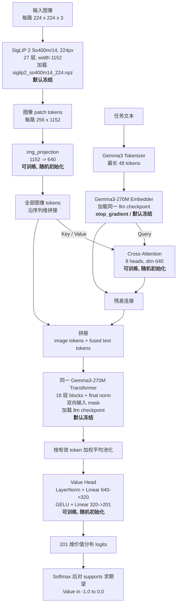

# 价值函数模型架构与冻结策略核对

本文根据当前代码实现回答以下问题：图像和文本分别由什么模型编码、哪些模块被冻结、融合后的 Gemma Transformer 是否加载 Gemma3 权重，以及默认训练时实际更新哪些参数。

## 结论

当前价值函数不是“SigLIP 不冻结 + 冻结的 Gemma3 文本模型 + 另一个 Gemma Transformer”的三模型结构。更准确的描述是：

1. 图像使用仓库内的通用 SigLIP ViT 实现，结构变体为 **So400m/14**；`--load_pretrained` 实际加载的文件是 `siglip2_so400m14_224.npz`，因此预训练视觉 backbone 应准确称为 **SigLIP 2 So400m/14（224px）**。模型前向中的 `train=False` 只控制运行模式，并不等价于冻结参数；真正的冻结由 `scripts/train_value.py` 的 `freeze_mode` 参数过滤器决定。当前命令行默认 `freeze_mode=all_backbones`，所以 **SigLIP 2 backbone 默认被冻结**。
2. 文本由 **Gemma3-270M 内部的 token Embedder** 编码。它不是一套独立的 Gemma3 模型，而是从同一个 `self.llm` 参数树中取出 `embedder` 权重。文本 embedding 随后显式经过 `jax.lax.stop_gradient`，因此不会通过价值损失学习文本 embedding。
3. 图像和文本不是直接拼接。SigLIP 图像 token 先投影到 640 维；Gemma3 文本 token 作为 Query、图像 token 作为 Key/Value，先经过一层 8-head Cross-Attention 和残差连接，然后才将 `[图像 token, 融合后的文本 token]` 拼接。
4. 拼接序列进入的确实是 **Gemma3-270M 的 18 层 Transformer blocks 和 final norm**。它与文本 Embedder 同属一个 `GemmaBlockRunner`/`self.llm`，不是第二份 Gemma。
5. 只有运行训练时传入 `--load_pretrained`，`ValueModelWeightLoader` 才会把 SigLIP 2 So400m/14 checkpoint 加载到 `img`，并把 Gemma3-270M checkpoint 加载到整个 `llm`，其中包括 Embedder、18 层 Transformer 和 final norm。若既不传 `--load_pretrained`，也不从训练 checkpoint 恢复，这些模块就是随机初始化。
6. 当前默认 `freeze_mode=all_backbones` 下，**SigLIP 2 backbone 和整个 Gemma3-270M 都被冻结**；默认可训练的是图像投影层、Cross-Attention、Cross-Attention LayerNorm 和 Value Head。

因此，对问题中的表述可直接回答为：

> 图像使用 SigLIP 2 So400m/14（224px）预训练 backbone，但当前训练脚本默认冻结；文本使用同一份 Gemma3-270M 的 Embedder，并显式停止梯度；融合序列再进入同一份 Gemma3-270M 的 18 层 Transformer。传入 `--load_pretrained` 时，视觉侧加载 SigLIP 2 checkpoint，Embedder 和 Transformer 加载 Gemma3-270M checkpoint；默认训练时两个 backbone 都冻结。

命名上需要区分“代码实现”和“加载的预训练模型”：`ValueModel` 构造的是 `_siglip.Module(variant="So400m/14")`，代码类名本身没有 `2`；但 `ValueModelWeightLoader` 明确读取 `siglip2-so400m-patch14-224-jax/siglip2_so400m14_224.npz`，所以当前预训练权重是 SigLIP 2，而不是 SigLIP 1。

## 整体架构图

下图表示“使用 `--load_pretrained` 且保持默认 `--freeze_mode all_backbones`”时的整体结构。一个 observation 可以包含多路图像，各路图像经过同一个 SigLIP 2 backbone 后沿序列维拼接。



这里的 Gemma3 Tokenizer 只负责把字符串转换为 token ID，没有模型参数，也不属于“冻结/训练”的讨论范围。

## 冻结模式

`scripts/train_value.py` 支持三种模式：

| `freeze_mode` | SigLIP 2 `img` | Gemma3 Embedder | Gemma3 Transformer | 投影、Cross-Attention、Value Head |
|---|---|---|---|---|
| `all_backbones`（默认） | 冻结 | 冻结 | 冻结 | 训练 |
| `siglip_only` | 冻结 | `stop_gradient`，无价值损失梯度 | 训练 | 训练 |
| `none` | 训练 | `stop_gradient`，无价值损失梯度 | 训练 | 训练 |

需要注意两层含义：

- `freeze_mode` 决定参数是否进入求导和优化器过滤范围。
- 文本 embedding 输出无条件执行 `stop_gradient`。所以即使 `freeze_mode=none`，Gemma Transformer 可以训练，文本 Embedder 仍然没有来自价值损失的有效梯度。

严格来说，在 `siglip_only` 和 `none` 模式下，Embedder 参数仍被 `llm` 路径过滤器选入 AdamW，虽然其反向梯度为零，但极小的解耦 weight decay（当前为 `1e-10`）理论上仍可能造成微量参数变化。默认 `all_backbones` 会把整个 `llm` 排除在优化器之外，因此 Embedder 和 Transformer 都是完全冻结的。

## 预训练权重如何加载

模型构造只创建 Gemma3-270M 和通用 SigLIP ViT 的参数结构，并进行随机初始化。预训练加载发生在训练状态创建阶段：

```text
--load_pretrained
    |
    +-- SigLIP 2 So400m/14 ------> params["img"]
    |   siglip2_so400m14_224.npz
    |
    +-- Gemma3-270M checkpoint ---> params["llm"]
                                      |-- embedder
                                      |-- layer_0 ... layer_17
                                      `-- final_norm

随机初始化并保留：
    img_projection
    cross_attention
    cross_attn_norm
    value_head
```

因此，“Gemma Transformer 是不是加载 Gemma3 权重”的答案是：**传入 `--load_pretrained` 时是；未传入时不是**。当前 loader 从代码内配置的本地 checkpoint 路径读取权重，并不会仅凭 `gemma_variant` 自动下载模型。

由于命令行默认同时满足“`load_pretrained=False`”和“`freeze_mode=all_backbones`”，从头启动训练时应显式传入 `--load_pretrained`，或者通过 `--resume_from_checkpoint` 恢复已经训练过的完整参数；否则会冻结随机初始化的 SigLIP 和 Gemma backbone。

## 前向数据流与维度

以默认输入规格中的两路图像和 48 个文本 token 为例：

1. 每路 `224 x 224` 图像由 SigLIP 2 So400m/14 按 `14 x 14` patch 划分，得到 `16 x 16 = 256` 个视觉 token，每个 token 为 1152 维。
2. 两路图像得到 512 个图像 token，经 `img_projection` 变成 `[B, 512, 640]`。
3. 文本由 Gemma3 Embedder 得到 `[B, 48, 640]`，padding token 通过 mask 标记为无效。
4. Cross-Attention 输出与原文本 embedding 残差相加，得到融合文本 token。
5. 图像 token 与融合文本 token 拼成最多 `[B, 560, 640]` 的序列，并送入 Gemma3 的 18 层 Transformer。
6. 根据输入 mask 对全部有效 token 做平均池化，再由 Value Head 输出 201 维 logits。
7. 训练时用 two-hot 目标计算交叉熵；推理时对 `[-1.0, 0.0]` 上的 201 个 supports 求概率期望，得到标量 value。

## 代码依据

| 结论 | 当前实现 |
|---|---|
| 默认模型变体 | [`ValueModelConfig`](../src/openpi/models/value_model_config.py)：`gemma3_270m`、`So400m/14` |
| 通用 SigLIP `So400m/14`、投影层与 Gemma runner 的构造 | [`ValueModel.__init__`](../src/openpi/models/value_model.py) |
| 实际视觉 checkpoint 为 `siglip2_so400m14_224.npz` | [`ValueModelWeightLoader`](../src/openpi/training/weight_loaders.py) |
| 文本 Embedder 取自 `llm` 且执行 `stop_gradient` | [`ValueModel.embed_tokens`](../src/openpi/models/value_model.py) |
| Cross-Attention、残差、拼接和 Gemma backbone 前向 | [`ValueModel.embed_tokens`](../src/openpi/models/value_model.py) |
| Gemma3-270M 为 18 层、640 维 | [`Gemma3_270M`](../gemma/gemma/gm/nn/_gemma.py) |
| 预训练权重分别加载进 `img` 和 `llm` | [`ValueModelWeightLoader`](../src/openpi/training/weight_loaders.py) |
| 三种冻结模式和默认值 | [`_make_trainable_filter` 与命令行参数`](../scripts/train_value.py) |
